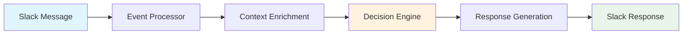
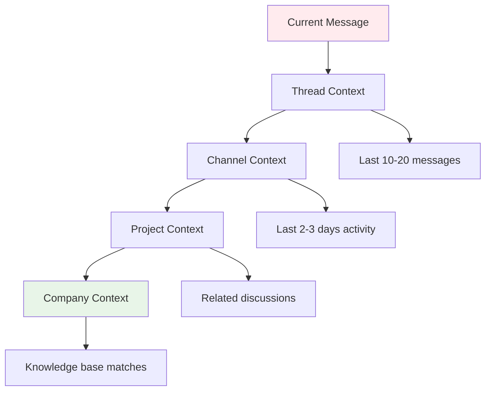

# Intelligent Slack Bot Architecture

## Table of Contents
- [Core Components Overview](#core-components-overview)
- [Detailed Architecture](#detailed-architecture)
- [Context Management Strategy](#context-management-strategy)
- [Intelligence Components](#intelligence-components)
- [Technical Implementation Stack](#technical-implementation-stack)
- [Implementation Phases](#implementation-phases)
- [Key Configuration Parameters](#key-configuration-parameters)
- [Privacy & Security Considerations](#privacy--security-considerations)
- [Success Metrics](#success-metrics)

## Core Components Overview

### 1. Data Ingestion & Processing Layer
- **Slack Events API**: Real-time message ingestion
- **Message Processor**: Filters, cleans, and structures incoming messages
- **Context Extractor**: Identifies key entities, topics, and relationships

### 2. Memory & Knowledge Management
- **Vector Database** (Pinecone/Weaviate/Chroma): Semantic search across all conversations
- **Graph Database** (Neo4j): Relationship mapping between users, channels, topics, and discussions
- **Relational Database** (PostgreSQL): Structured data, user preferences, channel configs
- **Company Knowledge Base**: Integrated docs, wikis, and internal resources

### 3. Intelligence & Context Layer
- **Context Manager**: Determines relevant context for each interaction
- **Thread Tracker**: Maintains conversation flow and references
- **Relevance Scorer**: Decides when to respond and how valuable the response would be
- **Persona Manager**: Maintains consistent "employee" personality and knowledge

### 4. Response Generation
- **LLM Router**: Chooses between different models based on query type
- **Prompt Constructor**: Builds context-aware prompts dynamically
- **Response Formatter**: Adapts output for Slack (mentions, formatting, etc.)

## Detailed Architecture

### Data Flow Pipeline



### Key Databases & Their Roles

#### Vector Database (Semantic Memory)
- **Purpose**: Fast semantic search across all conversations
- **Storage**: Message embeddings, document embeddings, code snippets
- **Retrieval**: Similar conversations, relevant knowledge base articles
- **Tools**: Pinecone, Weaviate, or Chroma DB

#### Graph Database (Relationship Memory)
- **Purpose**: Understanding relationships and conversation flow
- **Nodes**: Users, channels, threads, topics, projects, documents
- **Edges**: Replied-to, mentioned, collaborated-on, discussed-in
- **Queries**: "Who worked on project X?", "What channels discuss topic Y?"

#### Relational Database (Structured Memory)
- **Purpose**: Metadata, configurations, and structured data
- **Tables**: 
  - `messages` (id, content, channel, user, timestamp, thread_id)
  - `channels` (id, name, purpose, team, settings)
  - `users` (id, name, role, preferences, expertise_areas)
  - `projects` (id, name, status, team_members, related_channels)

## Context Management Strategy

### 1. Multi-Level Context Retrieval



### 2. Context Scoring System
- **Recency Score**: More recent messages weighted higher
- **Relevance Score**: Semantic similarity to current discussion
- **Importance Score**: Based on participants, reactions, thread length
- **Relationship Score**: How connected the context is to current participants

### 3. Dynamic Context Window
- Start with thread context (last 10-20 messages)
- Expand to channel recent activity (last 2-3 days)
- Include relevant cross-channel discussions
- Add company knowledge base matches

## Intelligence Components

### Decision Engine

```python
# Pseudo-code for response decision
def should_respond(message, context):
    factors = {
        'directly_mentioned': is_bot_mentioned(message),
        'question_asked': contains_question(message),
        'expertise_match': matches_bot_expertise(message),
        'conversation_gap': needs_clarification(context),
        'value_add_potential': can_provide_value(message, context)
    }
    
    score = weighted_score(factors)
    return score > RESPONSE_THRESHOLD
```

### Context Enrichment Process

1. **Thread Analysis**: Understand current conversation flow
2. **Participant Mapping**: Identify roles, expertise areas of participants  
3. **Topic Extraction**: Key themes, projects, technical terms
4. **Historical Context**: Related past discussions, decisions made
5. **Knowledge Base Search**: Relevant documentation, procedures
6. **Cross-Channel Context**: Related discussions in other channels

## Technical Implementation Stack

### Core Infrastructure
- **Message Queue**: Redis/RabbitMQ for handling high message volume
- **API Gateway**: Rate limiting, authentication, routing
- **Microservices**: Separate services for different functions
- **Caching**: Redis for frequently accessed context

### AI/ML Components
- **Embedding Model**: OpenAI embeddings or sentence-transformers
- **LLM Integration**: OpenAI GPT-4, Anthropic Claude, or local models
- **NLP Pipeline**: spaCy or similar for entity extraction, topic modeling

### Monitoring & Analytics
- **Response Quality Tracking**: User reactions, follow-up questions
- **Context Relevance Metrics**: How often retrieved context is useful
- **Performance Monitoring**: Response times, API usage, error rates

## Implementation Phases

### Phase 1: Foundation (Weeks 1-4)
- [ ] Set up Slack app with Events API
- [ ] Implement basic message ingestion and storage
- [ ] Create simple response system with direct mentions
- [ ] Set up vector database for basic semantic search

### Phase 2: Context Intelligence (Weeks 5-8)
- [ ] Implement thread tracking and conversation flow
- [ ] Add channel-specific context understanding
- [ ] Create decision engine for when to respond
- [ ] Integrate company knowledge base

### Phase 3: Advanced Memory (Weeks 9-12)
- [ ] Add graph database for relationship mapping
- [ ] Implement cross-channel context correlation
- [ ] Create user persona and expertise tracking
- [ ] Add learning from user feedback

### Phase 4: Optimization (Weeks 13-16)
- [ ] Fine-tune context retrieval algorithms
- [ ] Optimize response quality and relevance
- [ ] Add advanced features (proactive suggestions, meeting summaries)
- [ ] Implement comprehensive analytics

## Key Configuration Parameters

### Channel-Specific Settings

```yaml
channels:
  general:
    response_frequency: low
    context_window: 1_day
    topics: ["announcements", "company_updates"]
  
  engineering:
    response_frequency: high
    context_window: 3_days
    topics: ["code", "architecture", "bugs"]
    knowledge_sources: ["technical_docs", "code_repos"]
```

### Bot Personality Configuration

```yaml
persona:
  role: "Senior Technical Assistant"
  communication_style: "professional, helpful, concise"
  expertise_areas: ["software_development", "project_management", "company_processes"]
  response_tone: "collaborative, informative"
```

## Privacy & Security Considerations

- **Data Retention**: Configurable message retention periods
- **Access Control**: Respect Slack channel permissions
- **Sensitive Information**: Filter out passwords, API keys, personal data
- **Audit Logging**: Track all bot interactions and data access
- **Compliance**: GDPR, SOC2 compliance for enterprise usage

## Success Metrics

### Engagement Metrics
- Response relevance score (user reactions)
- Follow-up question rate
- Thread participation quality
- User satisfaction surveys

### Technical Metrics
- Context retrieval accuracy
- Response generation latency
- API usage efficiency
- Error rates and uptime

### Business Impact
- Time saved on repeated questions
- Knowledge transfer effectiveness
- Team collaboration improvement
- Onboarding acceleration for new team members

---

> This architecture provides a robust foundation for building an intelligent Slack bot that truly understands context and adds value to team communications.

## Contributing

1. Fork the repository
2. Create a feature branch
3. Make your changes
4. Submit a pull request

## License

This project is licensed under the MIT License - see the [LICENSE](LICENSE) file for details.